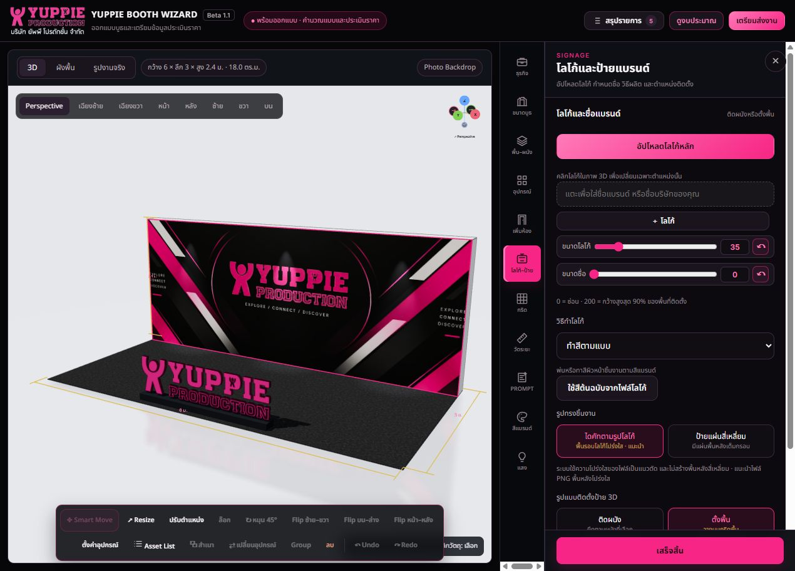

# Selection-driven editor flow — proposal, 2026-09-21

## Current evidence (bounded inspection, not a full interaction audit)

1. Current workspace: needs clearer selection/editor consistency. The captured screen highlights the back-wall graphic while the right panel shows Signage. The accessibility tree labels the Resize target as the back-wall sticker. This proves a mismatched current state, not which preceding click caused it. No design values or selections were changed during inspection.

Code inspection: logo-replacement.js routes recognized logos to Signage. index.html has separate paths for object, main-logo and system scene-item selection; wall-finish-ui.js exposes openFace. Consolidating routing must retain these specialized editors, rather than replace everything with the generic equipment editor.

## Proposed main flow

1. Select an item in 3D, plan view or Asset List using the same selection rules.
2. Highlight the exact item, identify its name/type/face, then open its corresponding right-panel editor.
3. Edit that instance with live preview; shared move/size/rotate/lock operations only appear when supported.
4. Undo/redo design edits. Changing selection must not reset values. Explicit draft editing requires Save/Discard/Continue before leaving with unsaved changes.

## Routing

| Selected target | Right panel | Scope |
|---|---|---|
| Independent logo/sign | Logo–Signage | Selected instance, including its mounting/base |
| Booth wall or its graphic | Floor–Wall > Wall | Clicked wall face; graphic controls when applicable |
| Booth floor | Floor–Wall > Floor | Floor finish and elevation |
| Furniture/imported GLB/decorative panel | Equipment > Asset Editor | Selected instance; detailed surface/sticker/edge-light editing in one editor |
| Room | Room settings | Selected room; explicit face edit inside it |
| Light fixture | Lighting | Selected light; global light controls separately labelled |
| Multiple items | Multi-selection editor | Count and common supported actions; no last-item tab jumping |

A logo baked into a wall image is not a separate logo object. A GLB that resembles a logo remains an equipment asset unless explicitly assigned a logo role. Route from stored role/ownership, not name or appearance.

## Interaction rules

- Route on completed click, not pointer-down, hover, camera drag or object drag.
- Measurement, edge-picking, surface-picking and placement modes own their clicks until exited. Escape exits the active mode first.
- Opening a library means adding/replacing; selecting existing equipment means editing. Opening an unrelated menu manually must not silently edit the previously selected item.
- Blank click clears selection without changing the design. In 3D blank drag rotates; in plan view blank drag performs box-selection; explicitly enabled box-selection overrides rotation with a clear mode label.
- Single-click selects a group; explicit group-entry allows child editing. Overlapping items need a pick list/cycle action and Asset List fallback.
- Locked objects remain selectable for inspection but unavailable actions explain why they are disabled.
- Match selection routing in 3D, plan and Asset List. Include keyboard access through Asset List, visible focus, and a text selection label rather than color alone.

## Limits and next step

This is a proposed interaction contract grounded in one current screenshot and relevant source paths. Pointer sequences, keyboard navigation, mobile behavior and accessibility compliance were not tested. Implement one shared selection-to-editor router first, then verify all routing rows plus the interaction exceptions above. No application code changed in this review.
